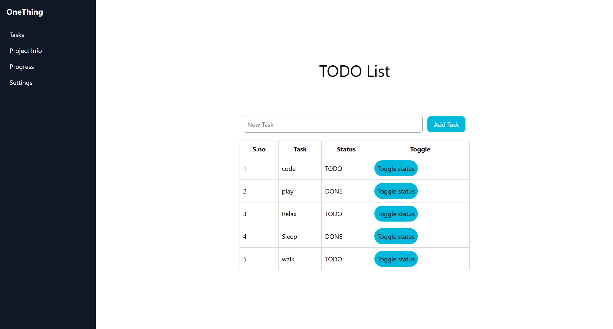

# OneThing

> A focused productivity app built to help me finish what I start.

---

## Why OneThing?

I struggled with:

- Starting multiple projects but not finishing them
- Context switching between tools (Notion, notes, TODO apps)
- Losing track of progress over time

**OneThing** exists to solve a single problem:  
👉 **focus on one project at a time and make visible progress every day.**

This is a personal tool first — built to match my workflow — and a learning project second.

---

## Core Features (Planned)

- ✅ Project-based TODO list  
- 📅 Deadlines per project  
- 🧠 Project ideas + tool notes  
- 📝 Daily progress logging  
- 🔔 Optional daily reminder notification  
- 📊 Simple progress visibility over time  

No cloud. No accounts. No distractions.

---

## Tech Stack

### Current

- **Frontend:** Svelte
- **Language:** JavaScript / HTML / CSS

### Possible Additions

- **Desktop wrapper:** Tauri (Rust)  
  - For native desktop builds
  - Local file storage
  - System notifications

> The app is intentionally built as a web-first application so it can evolve into a desktop app without a rewrite.

---

## Project Status

🚧 **Active development**

This project is being built incrementally with a strong focus on:

- shipping small, usable versions
- avoiding feature creep
- maintaining a clean architecture

---

## Roadmap (High-Level)

- [ ] Core project + TODO workflow
- [ ] Local persistence
- [ ] Progress logging
- [ ] Deadline tracking
- [ ] Desktop notifications (if Tauri is added)
- [ ] Polishing + stability

Detailed roadmap lives outside this README to keep this file concise.

---

## Design Philosophy

- One primary project at a time
- Minimal UI, maximum clarity
- Offline-first
- Local data ownership
- Built for long-term personal use, not virality

---

## What This Project Demonstrates

- Ability to design software around real personal problems
- Incremental development and scope control
- Frontend state management
- (Optional) Desktop app architecture with web + native integration

---

## Future Improvements

- SQLite-based storage
- Export logs as Markdown
- Keyboard-first workflow
- Cross-platform desktop builds

---

## License

This project is licensed under the MIT License — see the [LICENSE](LICENSE) file for details.
